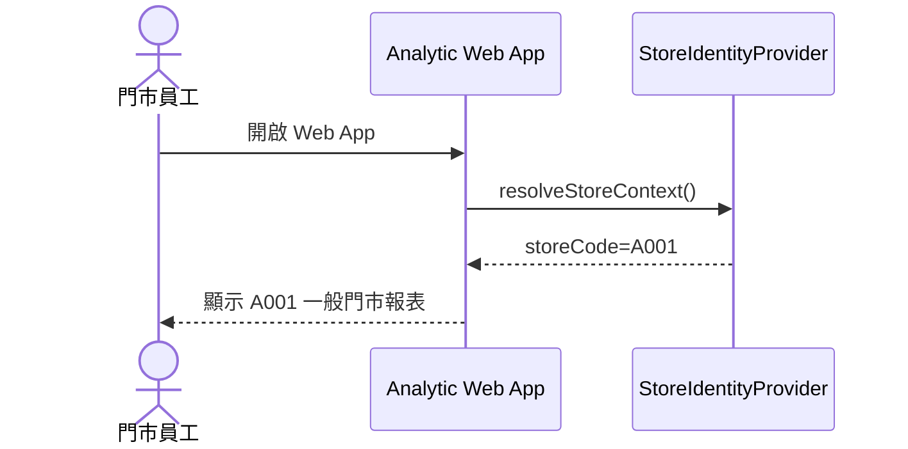
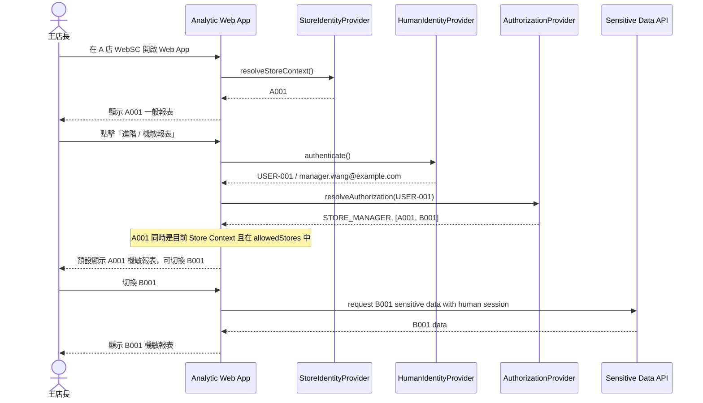
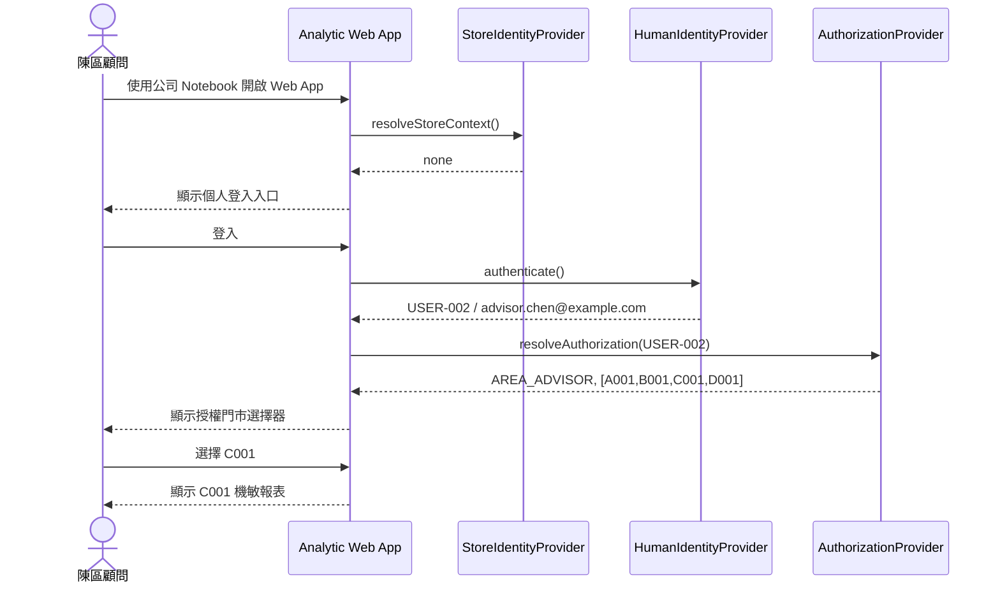
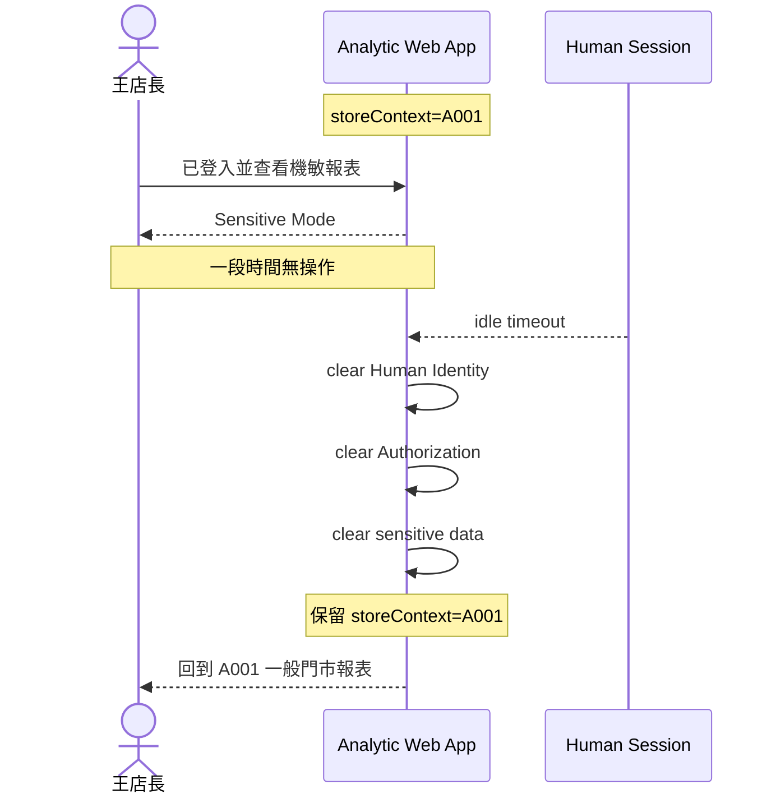
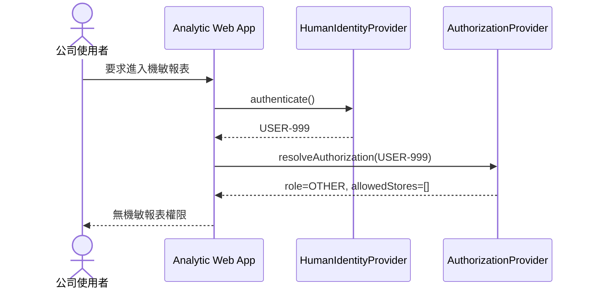

# Scenario Sequence v0.1

## Scenario A：門市員工查看一般報表



業務重點：

- 不要求門市一般員工再登入自己的個人帳號。
- 一般報表依 Store Context 顯示。
- 此狀態不能取得機敏資料。

---

## Scenario B：店長在 A 店查看 A / B 店機敏報表



業務重點：

- `A001` 只作為登入後的 UI 預設門市。
- 王店長仍可切換到其授權範圍內的 B001。
- 不能因「人在 A 店」而把實際授權縮限為 A 店。

---

## Scenario C：區顧問使用自己的公司電腦



業務重點：

- Store Context 不存在時仍可登入個人身分。
- 個人公司電腦不是門市裝置也不阻止機敏報表使用。
- 能看哪些店由 Authorization 決定。

---

## Scenario D：共用 WebSC 忘記登出



核心規則：

```text
Human Session timeout
!=
Store Context logout
```

---

## Scenario E：授權失敗



不得因為「Google 登入成功」就視為具有機敏資料權限。
